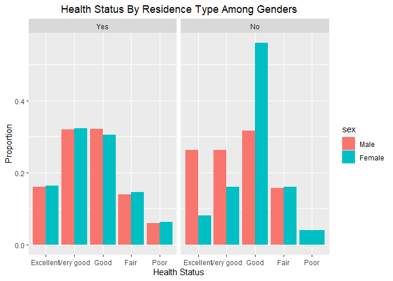
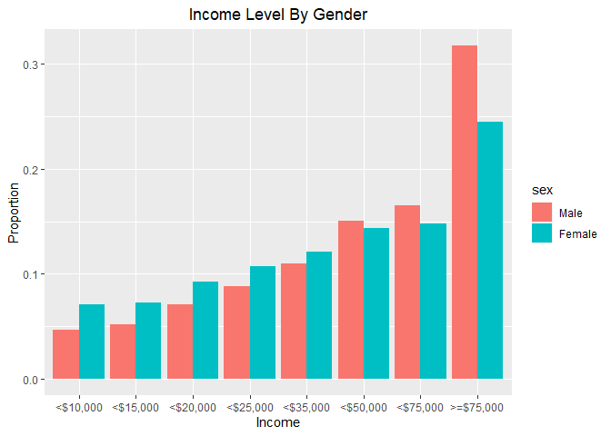
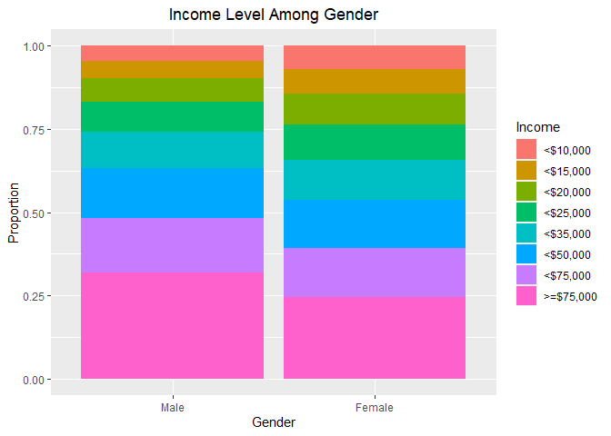
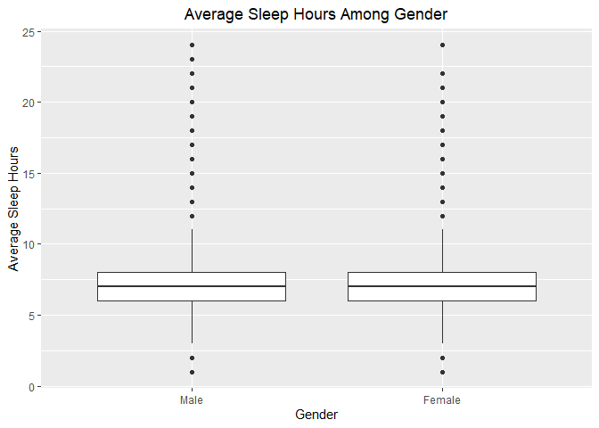
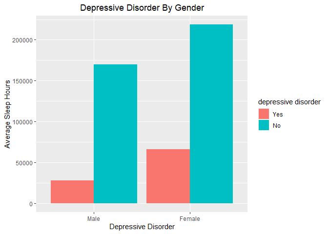
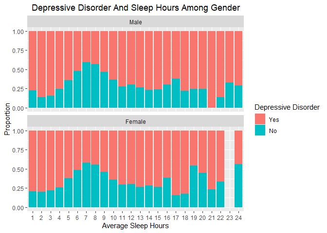

BRFSS Dataset: EDA
================

## Research Questions

**Research Question 1:**<br /> What is the general health status for
people who live in private Residence compared to college housing ? And
how does that differ among genders?

**Research Question 2:**<br /> Do men have higher income level than
women? And what is the most common income level among each gender?

**Research Question 3:**<br /> Does gender effect the average sleeping
hours? And Is there any relation between sleeping hours and having
depressive disorder?

-----

## About The Data

**Data Collection Method :**<br /> BRFSS collects health-related data in
all 50 states as well as the District of Columbia and three U.S.
territories. The data is collected using both landline telephone- and
cellular telephone-based surveys. Random Digit Dialing (RDD) techniques
are used to obtain participants’ telephone numbers on both landlines and
cell phones. The number of interviews may vary between the states based
on funding and the size of the region.<br /> For more Information visit:
<https://www.cdc.gov/brfss/>

**Targeted Population:**<br /> The Surveys target adult population, aged
18 years or older.

-----

## Load packages

``` r
library(ggplot2)
library(dplyr)
```

    ## Warning: package 'dplyr' was built under R version 4.0.3

``` r
load("brfss2013.RData")
```

-----

## Exploratory Data Analysis

### Research Question 1:

``` r
#select the targeted variables
brfss2013_q1 <- brfss2013 %>%
  select(pvtresd1, sex, genhlth)

#check if any null value 
colSums(is.na(brfss2013_q1))
```

    ## pvtresd1      sex  genhlth 
    ##   131636        7     1985

``` r
#remove null values for all variables
brfss2013_q1 <- brfss2013_q1 %>%
filter(!is.na(pvtresd1),!is.na(sex), !is.na(genhlth))
```

``` r
#Exploring The data
brfss2013_q1 %>%
  group_by(pvtresd1) %>%
  summarise(n())
```

    ## `summarise()` ungrouping output (override with `.groups` argument)

    ## # A tibble: 2 x 2
    ##   pvtresd1  `n()`
    ##   <fct>     <int>
    ## 1 Yes      358476
    ## 2 No           44

only 44 in the sample live in college housing and the rest live in
private residence. Due to the small number of college housing residents
the analysis might not reflect the true reality, but we will use the
sample anyway to get an idea.

Let’s take a look at the Marginal frequencies for each Health status by
residence type

``` r
prop.table(table(brfss2013_q1$pvtresd1, brfss2013_q1$genhlth), 1)
```

    ##      
    ##        Excellent  Very good       Good       Fair       Poor
    ##   Yes 0.16249623 0.32116515 0.31076278 0.14313371 0.06244212
    ##   No  0.15909091 0.20454545 0.45454545 0.15909091 0.02272727

``` r
#let's visualize the frequencies using a bar plot
ggplot(brfss2013_q1, aes(x = genhlth, group = pvtresd1, fill = pvtresd1)) +
  geom_bar(aes(y = ..prop..), position = "dodge") +
  labs(title = "Health Status By Residence Type",
       x = "Health Status",
       y = "Proportion",
       fill = "Private Residence") +
  theme(plot.title = element_text(hjust = 0.5))
```

<!-- -->

``` r
#print the relative frequency of each gender
prop.table(table(brfss2013_q1$sex))
```

    ## 
    ##     Male   Female 
    ## 0.373332 0.626668

Frequency table for health status, Residence type and gender

``` r
  table(brfss2013_q1$sex, brfss2013_q1$genhlth, brfss2013_q1$pvtresd1)
```

    ## , ,  = Yes
    ## 
    ##         
    ##          Excellent Very good  Good  Fair  Poor
    ##   Male       21447     42717 42995 18602  8067
    ##   Female     36804     72413 68406 32708 14317
    ## 
    ## , ,  = No
    ## 
    ##         
    ##          Excellent Very good  Good  Fair  Poor
    ##   Male           5         5     6     3     0
    ##   Female         2         4    14     4     1

Plotting health status for different Residence type grouped by gender

``` r
  ggplot( brfss2013_q1, aes(x = genhlth, fill = sex, group =sex ))+
    geom_bar(aes(y = ..prop..), position = position_dodge()) +
    facet_wrap(~pvtresd1) +
    labs(title = "Health Status By Residence Type Among Genders",
       x = "Health Status",
       y = "Proportion") +
   theme(plot.title = element_text(hjust = 0.5))
```

<!-- -->

Overall we can observe that in private Residence the proportions of
health status among the genders are almost the same. on the other in the
college housing men have better proportions when it comes to “excellent”
and very “good” status, in contrast to women which have better “Good”
proportion.

### Research Question 2:

Select the variables of interest

``` r
#select
brfss2013_q2 <- brfss2013 %>%  
  filter(!is.na(income2), !is.na(sex)) %>%
  select(income2, sex)

#change labels for income
levels(brfss2013_q2$income2) <- c("<$10,000","<$15,000" ,"<$20,000", "<$25,000", "<$35,000", "<$50,000", "<$75,000", ">=$75,000")
```

view the frequency table of income level and gender

``` r
table(brfss2013_q2$income2, brfss2013_q2$sex)
```

    ##            
    ##              Male Female
    ##   <$10,000   8296  17145
    ##   <$15,000   9207  17586
    ##   <$20,000  12562  22311
    ##   <$25,000  15734  25998
    ##   <$35,000  19628  29239
    ##   <$50,000  26817  34692
    ##   <$75,000  29405  35826
    ##   >=$75,000 56537  59365

View The marginal frequnces to get a better Idea

``` r
prop.table(table(brfss2013_q2$income2, brfss2013_q2$sex), 2)
```

    ##            
    ##                   Male     Female
    ##   <$10,000  0.04655809 0.07079971
    ##   <$15,000  0.05167073 0.07262081
    ##   <$20,000  0.07049937 0.09213254
    ##   <$25,000  0.08830099 0.10735788
    ##   <$35,000  0.11015456 0.12074149
    ##   <$50,000  0.15050004 0.14325947
    ##   <$75,000  0.16502419 0.14794229
    ##   >=$75,000 0.31729204 0.24514581

Plot the Income level grouped by Sex

``` r
ggplot(brfss2013_q2, aes(income2, group = sex, fill = sex)) +
  geom_bar(aes(y = ..prop..), position = "dodge") +
  labs(title = "Income Level By Gender",
       x = "Income",
       y = "Proportion") +
    theme(plot.title = element_text(hjust = 0.5))
```

<!-- -->

It looks like women have higher proportion for the income levels from
“less than 10k” until “less than 35k”. However, men have higher
proportions form the income level “less than 50k” and above.

let’s take a look from another angel to see how the proportions look for
each gender individually.

``` r
ggplot(brfss2013_q2, aes(sex, fill = income2)) +
  geom_bar(position = "fill") +
  labs(title = "Income Level Among Gender",
       x = "Gender",
       y = "Proportion",
       fill = "Income") +
    theme(plot.title = element_text(hjust = 0.5))
```

<!-- -->

The graph indeed support the previous graph. So it seems there is an
association between gender and the income level.

### Research Question 3:

Select the variables of interest

``` r
brfss2013_q3 <- brfss2013 %>%
  select(sex, sleptim1, addepev2) 
```

view summary statistics for the variables

``` r
summary(brfss2013_q3)
```

    ##      sex            sleptim1       addepev2     
    ##  Male  :201313   Min.   :  0.000   Yes : 95779  
    ##  Female:290455   1st Qu.:  6.000   No  :393707  
    ##  NA's  :     7   Median :  7.000   NA's:  2289  
    ##                  Mean   :  7.052                
    ##                  3rd Qu.:  8.000                
    ##                  Max.   :450.000                
    ##                  NA's   :7387

Removing observations that contain Null values

``` r
#remove null values in both variables
brfss2013_q3 <- brfss2013_q3 %>%
  filter(!is.na(sex), !is.na(sleptim1), !is.na(addepev2))
```

Removing observations that contain invalid values, in this case sleeping
hours that are more than 24

``` r
#remove invalid entries from sleptim1
brfss2013_q3 <- brfss2013_q3 %>%
  filter(sleptim1 <= 24)
```

``` r
#Gender Relative frequency table 
prop.table(table(brfss2013_q3$sex))
```

    ## 
    ##      Male    Female 
    ## 0.4103382 0.5896618

Plot the distribution of sleeping hours for each gender

``` r
ggplot(brfss2013_q3, aes(y = sleptim1, x = sex)) +
  geom_boxplot() +
  labs(title = "Average Sleep Hours Among Gender",
       x = "Gender",
       y = "Average Sleep Hours",
       fill = "Private Residence?") +
    theme(plot.title = element_text(hjust = 0.5))
```

<!-- -->

It appears that the both gender have similar average sleeping hours
distributions. Observations with high hours of sleep may require further
investigation it seems there are few of them.

``` r
#View summary statistics for the above graph to get a better Idea
brfss2013_q3 %>%
  group_by(sex) %>%
  summarize(mean = mean(sleptim1),
         median = median(sleptim1))
```

    ## `summarise()` ungrouping output (override with `.groups` argument)

    ## # A tibble: 2 x 3
    ##   sex     mean median
    ##   <fct>  <dbl>  <dbl>
    ## 1 Male    7.03      7
    ## 2 Female  7.07      7

``` r
brfss2013_q3 %>%
  ggplot(aes(x = sex, fill = addepev2)) +
  geom_bar(position = "dodge") +
  labs(title = "Depressive Disorder By Gender",
       x = "Depressive Disorder",
       y = "Average Sleep Hours",
       fill = "depressive disorder") +
    theme(plot.title = element_text(hjust = 0.5))
```

<!-- -->

Among gender, women have higher proportion of depressive disorder.

Plot the proportion of depressive disorder for each avargae sleep hour
by gender

``` r
  ggplot(brfss2013_q3, aes(as.factor(sleptim1) ,group = addepev2, fill = addepev2)) +
    geom_bar( position = "fill", aes(y = ..prop..)) +
    facet_wrap(~sex, ncol = 1) +
  labs(title = "Depressive Disorder And Sleep Hours Among Gender",
       x = "Average Sleep Hours",
       y = "Proportion",
       fill = "Depressive Disorder") +
    theme(plot.title = element_text(hjust = 0.5))
```

<!-- -->

The proportion of people who have depressive disorder increases as the
sleep hours diverge from the average (7 hours). Both genders have
similar pattern with slight difference for sleep hours above 16.
